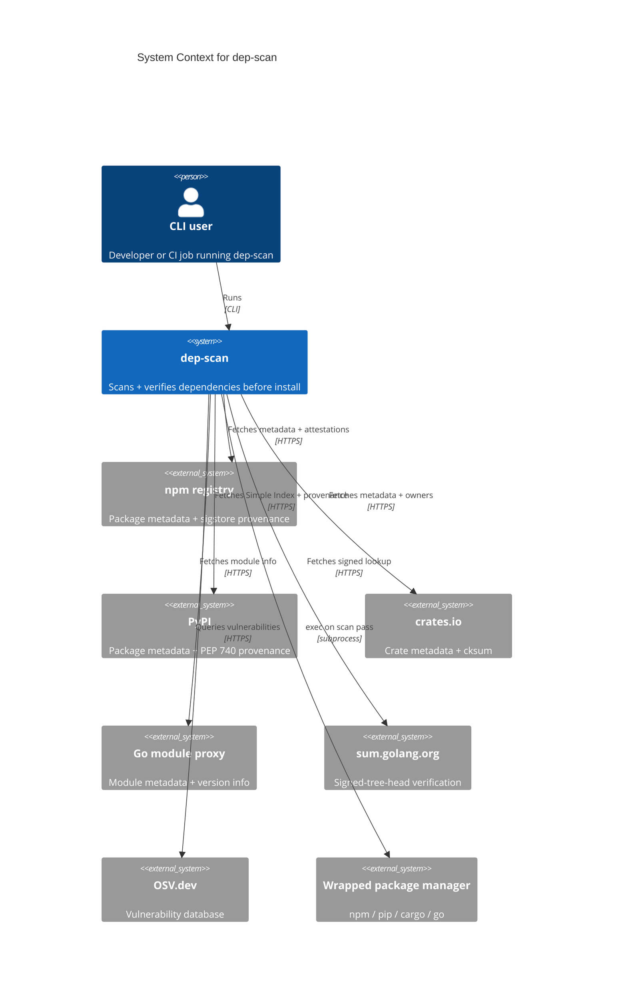
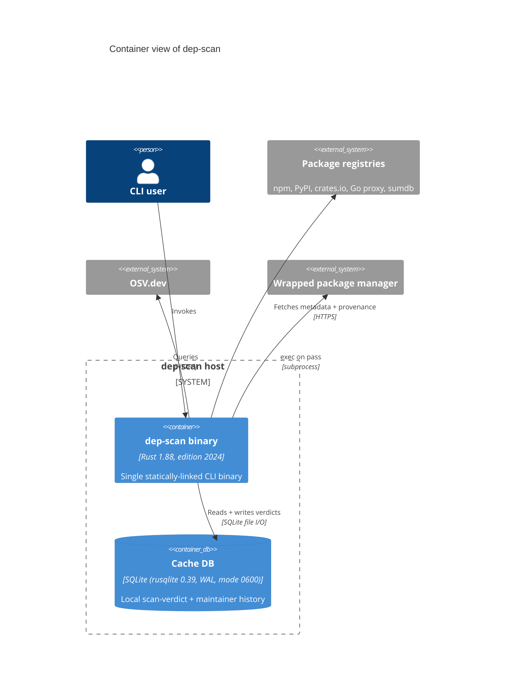
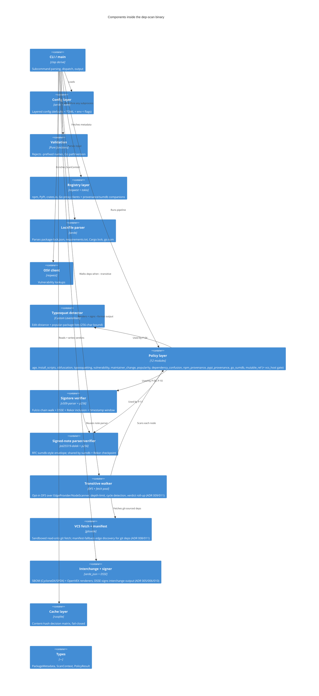
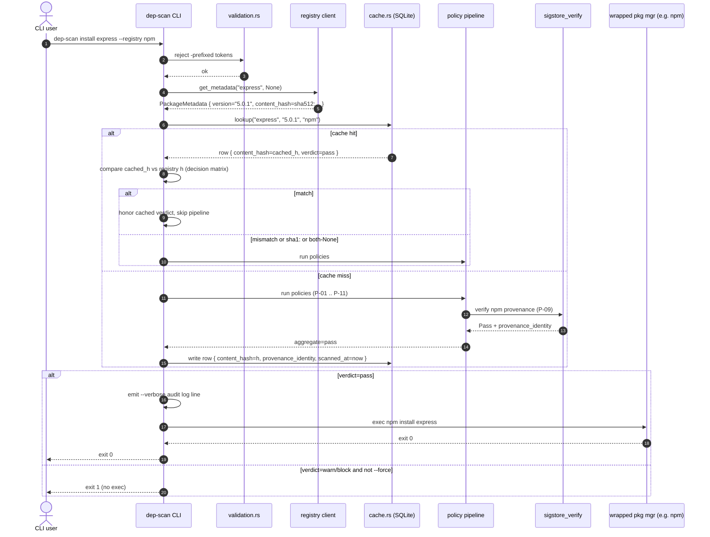
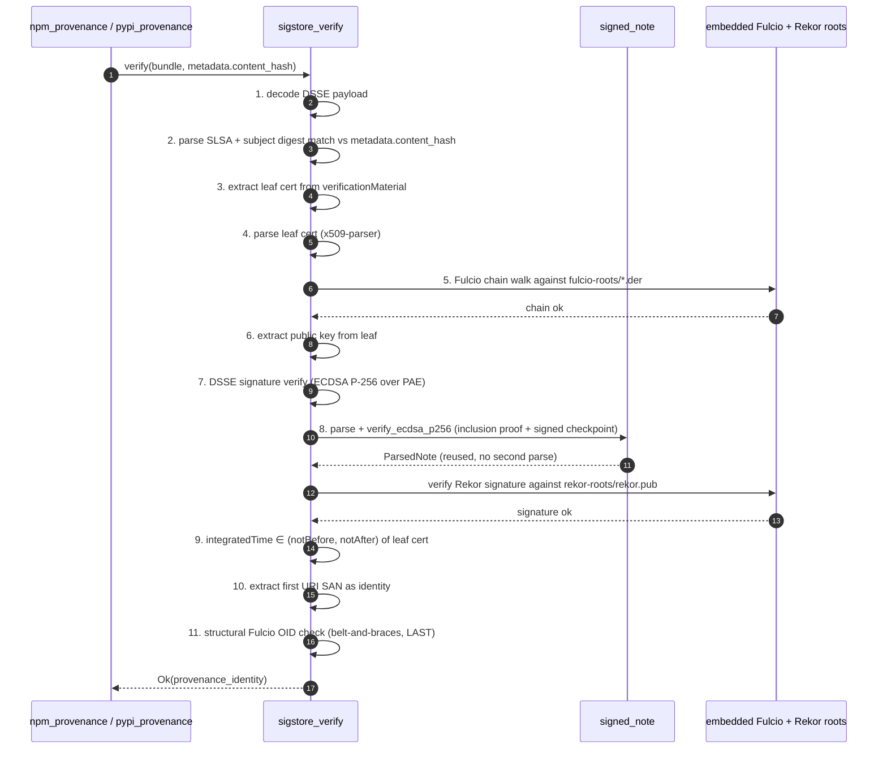
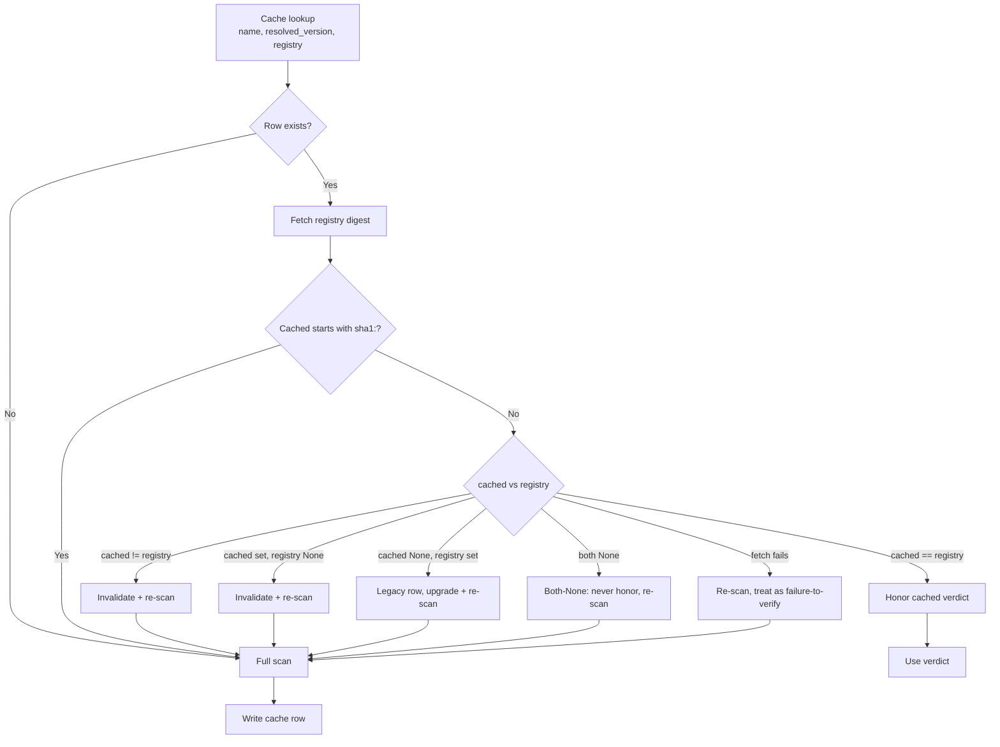

# Architecture Diagrams

**Project:** dep-scan
**Last updated:** 2026-06-21 (task 108 — transitive walker, SBOM/VEX renderers, interchange signer in the component view)

C4-structured Mermaid diagrams covering the system at three progressively detailed levels (Context → Container → Component), plus runtime sequence flows showing how the pieces collaborate. See [overview.md](overview.md) for prose context, [decisions/](decisions/) for the ADRs referenced here, and [`../spec/architecture.md`](../spec/architecture.md) for the structured element catalog these diagrams render.

These diagrams are part of the **authoritative spec** for this project. Code changes that contradict a diagram either invalidate the change or invalidate the diagram; one must be updated to match the other in the same commit.

GitHub and most IDE markdown previewers render Mermaid natively — no build step required.

---

## 1. System Context — who uses it and what it touches

> **Build-time trust roots are not shown** — the sigstore Fulcio + Rekor *verification* roots and the sum.golang.org public key are embedded via `include_bytes!` / `const` and are **not** runtime dependencies for verification. See [ADR 003 § Embedded trust roots](decisions/003-content-hash-cache-integrity.md).
>
> **Keyless interchange signing is a separate runtime outbound** (task 087, [behaviors B-030](../spec/behaviors.md#b-030-signing-identity-resolution-and-fail-closed)): when emitting a signed `--format osv|cyclonedx|spdx|vex` report online, dep-scan calls Fulcio (cert issuance) + Rekor (log entry) over HTTPS using the configurable `signing.fulcio_url` / `signing.rekor_url`. Offline, the `OperatorKeySigner` signs locally from `signing.key_path` with no network. This is the only place dep-scan makes a runtime sigstore *signing* call; verification remains offline against the embedded roots.

---

## 2. Containers — deployable units inside the system

dep-scan is a one-shot CLI — there's no long-lived process. The cache DB is the only persistent state.

---

## 3. Components — what's inside the binary

---

## 4. Runtime — `dep-scan install` happy path

---

## 5. Runtime — sigstore verification pipeline (P-09 / P-10)

The step order below mirrors `verify_dsse_bundle` in [`src/sigstore_verify.rs`](../../src/sigstore_verify.rs). Notable: subject-digest match runs **before** the chain walk so a digest mismatch produces a distinct error; the structural Fulcio-OID check runs **last** as a belt-and-braces assertion.

Any failure ⇒ `PolicyResult::Block(reason naming the failing step)`. See [behaviors.md § B-018](../spec/behaviors.md#b-018-sigstore-verification-pipeline-npm--pypi).

---

## 6. Runtime — cache decision matrix

The decision matrix is in [`../spec/data-model.md` § Cache decision matrix](../spec/data-model.md#cache-decision-matrix) and is verified by fitness functions F-002, F-007, and F-008 (see [fitness-functions.md § Rules](../spec/fitness-functions.md#rules)).

---

## Drift-audit checklist

When working on dep-scan, ask: does my change require any of these updates?

| Change | Updates required |
|--------|------------------|
| New external dependency (registry, API) | Section 1 (Context), Section 2 (Container) |
| New policy module | Section 3 (Component), [behaviors.md](../spec/behaviors.md) P-NN entry |
| New verification step in sigstore pipeline | Section 5 sequence, [behaviors.md § B-018](../spec/behaviors.md#b-018-sigstore-verification-pipeline-npm--pypi) |
| New CLI subcommand or flag | [interfaces.md](../spec/interfaces.md), Section 4 sequence if it changes flow |
| New cache decision branch | Section 6 flowchart, [data-model.md § Cache decision matrix](../spec/data-model.md#cache-decision-matrix), [F-NNN](../spec/fitness-functions.md) |
| New embedded trust root | [ADR 003 § Embedded trust roots](decisions/003-content-hash-cache-integrity.md), [architecture.md § Cross-cutting decisions](../spec/architecture.md#5-cross-cutting-decisions) |
